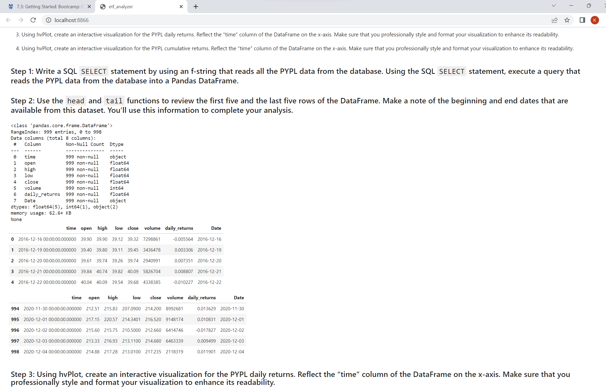

# Housing Price and Rental Analysis of San Fransisco Housing
---
This project extensively leverages the SQL databases and is anchored in the use of the python SQLAlchemy library.

## Technologies

Key python libraries required for the program have been imported in the first code block and includes- `pandas`, `pathlib` and 
`hvplot` and `SQLAlchemy`.

SQLAlchemy is an open source SQL Library for Python and is installed on the system with Anaconda. The code below will help confirm the availability of the library in the environment 

```python
 conda list sqlalchemy
```

---

## Installation Guide

In case SQLALchemy library are unavailable the following commands in the terminal will help install it using pip.

```python
pip install SQLAlchemy
```

---

## Usage

In this challenge the stock prices provided in an sql db were analysed specifically for PYPL. Below plots were generated using hvplot.


As part of the project, the voila module was also deployed. The screenshots below show
A. The initialization of voila
B. The Execution of voila
C. The output sample from voila



---

## Contributors


Kunal Srinivasan

---

## License

2022 edX Bootcamps 